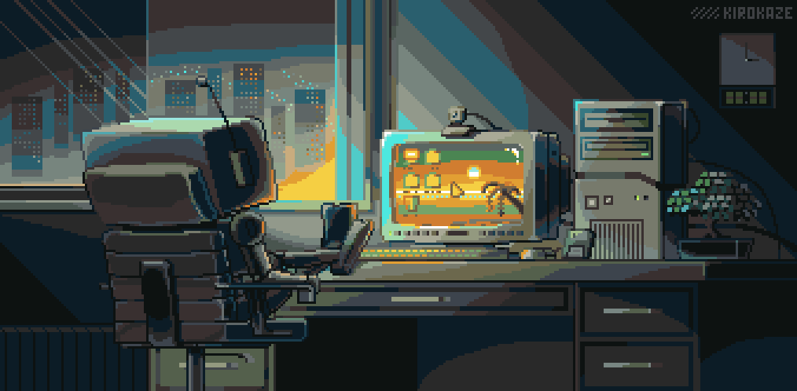

 <div align="center">



```text
╔═══════════════════════════════════════════════════════════╗
║   > iniciando sistema...                       [OK]       ║
║   > carregando perfil: Lucas.exe              [OK]       ║
║   > ADS em progresso...                       [ON]       ║
║   > café: suficiente                          [OK]       ║
╚═══════════════════════════════════════════════════════════╝
```

### `< hello.world />`

**Lucas** · Psicólogo · Estudante de Análise e Desenvolvimento de Sistemas

Atualmente estou construindo minha base em **desenvolvimento de software**, com foco em **Back-end com Python**.

Também estudo **SQL** e desenvolvo projetos práticos para transformar conhecimento em experiência. Tenho interesse em aprender tecnologias de Front-end e, futuramente, evoluir para o desenvolvimento **Full Stack**.

</div>

---

## `> tech.stack`

<div align="center">


</div>

---

## `> focus`

```text
Back-end
└── Python

Database
├── SQL
└── SQLite

Future learning
└── Front-end → Full Stack
```

---

## `> github.stats`

<div align="center">


</div>

---

## `> roadmap`

```text
Python
  │
  └── Back-end
       │
       ├── SQL / Databases
       │
       └── APIs
              │
              ↓
           Projects
              │
              ↓
          Full Stack
```

---

## `> about`

```text
Background      → Psychology
Education       → ADS • Instituto Infnet

Main focus      → Back-end
Language        → Python
Database        → SQL • SQLite
Tools           → VS Code • Git • GitHub

Goal            → Full Stack
```

---

<div align="center">

[](https://www.linkedin.com/in/lucpert/)
[](mailto:pertussattilucas@gmail.com)

<br>

```text
// made with ☕ + curiosity + consistency
```


</div>
